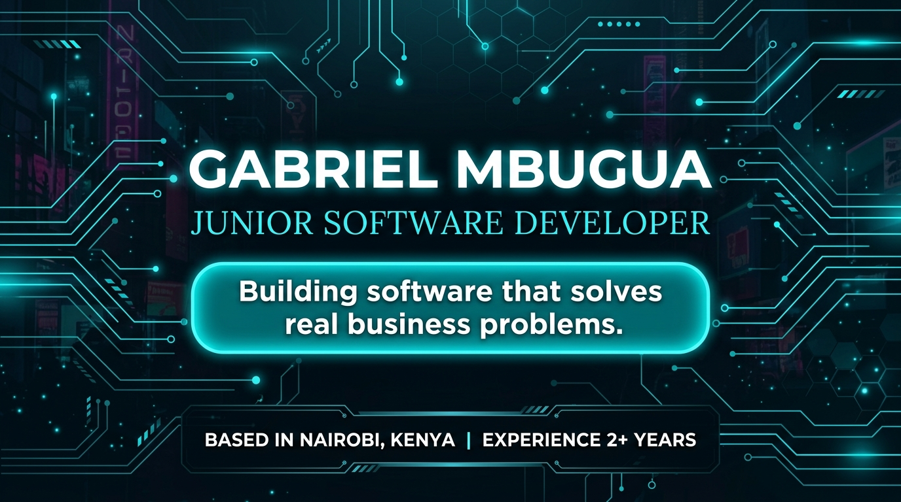

  

# 👋 Hi there!

### Building software that solves real business problems.

---

## 👨‍💻 About Me

I'm a Software Developer from **Kenya 🇰🇪** pursuing a **Bachelor of Science in Information Technology**.

I enjoy building software that solves real business problems through practical, scalable solutions.

# 📫 Connect With Me

📧 **Email:** gabrielmbugua003@gmail.com

💼 **LinkedIn:** https://www.linkedin.com/in/gabriel-mbugua-69147b290/

🌍 **GitHub:** https://github.com/GybuTech

---

# ⚡ Fun Fact

> I enjoy turning real business challenges into software solutions.

### ⭐ Thanks for visiting my profile!

